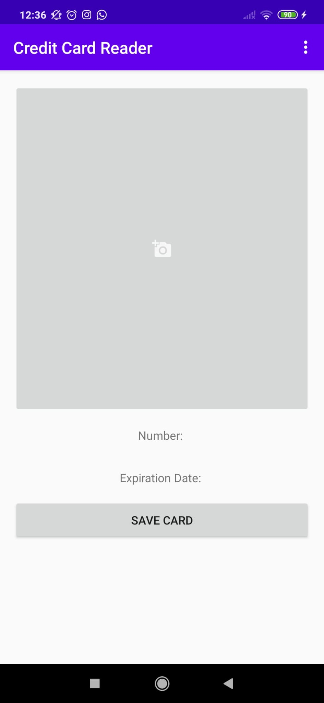

# Credit-Card-Reader-Android-App
Android app allowing to take a picture of a credit card and to get data from it.

# Features
Credit card data can be stored and shared via mail, whatsapp etc. 

# Requirements
* Proper OpenCV app version has to be installed on device.  
* File eng.traineddata has to be placed in device file system at path "/storage/emulated/0/tesseract/tessdata/eng.traineddata"

# External libraries
* [OpenCV Android SDK (v. 3.4.3)](https://sourceforge.net/projects/opencvlibrary/files/opencv-android/3.4.3/opencv-3.4.3-android-sdk.zip/download)   
* Tesseract for Optical Character Recognition

# App Preview

